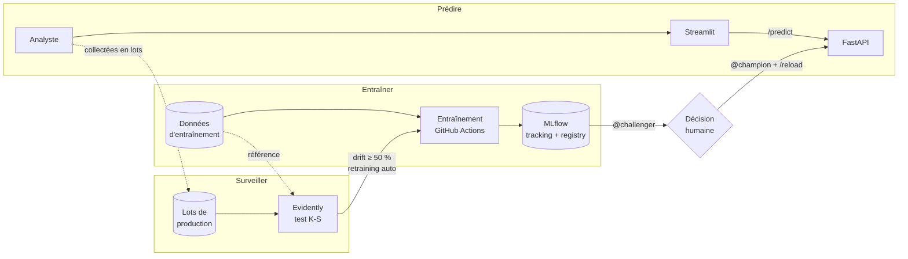

# EnterpriseRisk AI

**Un score de risque de faillite d'entreprise, et le cycle de vie MLOps qui le garde fiable en production.**

EnterpriseRisk AI aide une équipe risque à **prioriser** les entreprises à examiner : à partir de 5 ratios financiers, une API renvoie un score de risque de faillite, la décision au seuil choisi et l'identifiant exact du modèle qui l'a produit. Autour du modèle, le projet met en œuvre la chaîne MLOps complète : suivi des expériences, registre de modèles, déploiement continu, détection de drift, réentraînement automatique et promotion sous contrôle humain.

> **Projet de démonstration MLOps** réalisé dans le cadre de la certification Jedha Lead AI (Bloc 4). Ce n'est pas un outil de décision crédit : les données sont historiques, le score n'est pas calibré et aucune validation métier ou réglementaire n'a été conduite. Voir [Limites](#limites).

---

## Sommaire

- [Vue d'ensemble](#vue-densemble)
- [Architecture](#architecture)
- [Démarrage rapide](#démarrage-rapide)
- [Configuration](#configuration)
- [Pipelines automatisés](#pipelines-automatisés)
- [Cycle de vie du modèle](#cycle-de-vie-du-modèle)
- [Résultats](#résultats)
- [Structure du dépôt](#structure-du-dépôt)
- [Limites](#limites)
- [Documentation détaillée](#documentation-détaillée)
- [Équipe](#équipe)

---

## Vue d'ensemble

| | |
|---|---|
| **Problème métier** | Une équipe risque suit des milliers d'entreprises et ne peut pas toutes les examiner : elle doit prioriser, sans rater les faillites ni se noyer dans les fausses alertes. |
| **Données** | [UCI Taiwanese Bankruptcy Prediction](https://archive.ics.uci.edu/dataset/572/taiwanese+bankruptcy+prediction) : 6 819 entreprises, 95 ratios, 220 faillites (3,23 %). |
| **Modèle en production** | XGBoost sur 5 ratios, choisi parmi 3 candidats par validation croisée sur la PR-AUC. |
| **Service** | API FastAPI + interface Streamlit, conteneurisées, déployées sur Google Cloud Run. |
| **MLOps** | MLflow (tracking + registry, alias `@champion` / `@challenger`), GitHub Actions, Cloud Build, Evidently (data drift), réentraînement déclenché par le drift. |

---

## Architecture



Trois boucles reliées : **entraîner** (données → entraînement → MLflow), **prédire** (Streamlit → API qui sert toujours `@champion`) et **surveiller** (Evidently compare chaque lot de production aux données d'entraînement ; un drift relance l'entraînement). Le nouveau modèle arrive en `@challenger` : **la mise en production reste une décision humaine**.

Détails : [docs/architecture.md](docs/architecture.md).

---

## Démarrage rapide

### Prérequis

- Python 3.12 (environnement conda recommandé)
- Accès à un serveur MLflow et au stockage d'artefacts S3 (pour l'entraînement et l'API)
- Docker (optionnel, pour exécuter les services en conteneur)

### Installation

```bash
git clone https://github.com/hightechmehdi/enterprise-risk-ai.git
cd enterprise-risk-ai
conda create -n enterprise-risk-ai python=3.12 -y
conda activate enterprise-risk-ai
pip install --upgrade pip
pip install --no-cache-dir -r requirements.txt
```

### Lancer les tests

```bash
python -m pytest -q
```

16 tests : qualité et contrat des données (`tests/test_data.py`) et détection de drift (`tests/test_monitoring.py`).

### Entraîner les modèles

```bash
export PYTHONPATH=.
export MLFLOW_TRACKING_URI="https://<serveur-mlflow>"
export AWS_ACCESS_KEY_ID="..." AWS_SECRET_ACCESS_KEY="..."
python src/training/train.py
```

Entraîne les 3 candidats, les trace dans l'expérience MLflow `EnterpriseRisk_Model_Selection`, évalue le meilleur sur le jeu de test et pose l'alias `MODEL_ALIAS` (`challenger` par défaut). Voir [docs/model_card.md](docs/model_card.md).

### Lancer l'API en local

```bash
cd services/api
export MLFLOW_TRACKING_URI="https://<serveur-mlflow>" MODEL_NAME="prod-mlflow-server" MODEL_ALIAS="champion"
export AWS_ACCESS_KEY_ID="..." AWS_SECRET_ACCESS_KEY="..."
uvicorn app:app --port 8000
```

Documentation interactive : <http://localhost:8000/docs>. Référence complète : [docs/api.md](docs/api.md).

### Lancer l'interface Streamlit en local

```bash
cd services/app
export FASTAPI_URL="http://localhost:8000"
streamlit run app.py
```

### Contrôler le drift et ouvrir Evidently UI

```bash
export PYTHONPATH=.
python -m src.monitoring.monitor --generate                  # crée les lots simulés
python -m src.monitoring.monitor --current-csv data/monitoring/prod_batch_2026-09_normal.csv
python -m src.monitoring.monitor --current-csv data/monitoring/prod_batch_2026-10_shock.csv
evidently ui --workspace evidently_workspace --port 8001   # http://localhost:8001
```

Voir [docs/monitoring.md](docs/monitoring.md).

---

## Configuration

Toute la configuration passe par des variables d'environnement : aucune valeur propre à un environnement n'est écrite dans le code.

| Variable | Utilisée par | Rôle | Défaut |
|---|---|---|---|
| `MLFLOW_TRACKING_URI` | entraînement, API | Adresse du serveur MLflow | — (obligatoire) |
| `AWS_ACCESS_KEY_ID` / `AWS_SECRET_ACCESS_KEY` | entraînement, API | Accès au stockage S3 des modèles | — (obligatoire) |
| `MODEL_NAME` | API | Nom du modèle dans le Registry | — (en production : `prod-mlflow-server`) |
| `MODEL_ALIAS` | API, entraînement | API : alias servi (`champion`). Entraînement : alias posé sur le nouveau modèle | entraînement : `challenger` |
| `THRESHOLD` | API | Seuil de décision sur le score | `0.5` |
| `FASTAPI_URL` | Streamlit | Adresse de l'API | — (obligatoire) |
| `BACKEND_STORE_URI` / `ARTIFACT_ROOT` | serveur MLflow | Base Postgres des métadonnées / bucket S3 des artefacts | — (obligatoire) |
| `EVIDENTLY_UI_URL`, `EVIDENTLY_API_KEY` | monitoring | Envoi des rapports vers un Evidently distant ou Cloud | espace local `evidently_workspace/` |

En production, les secrets sont stockés dans **GCP Secret Manager** (services Cloud Run) et **GitHub Secrets** (workflows). Aucun secret n'est versionné.

---

## Pipelines automatisés

| Workflow | Déclenchement | Ce qu'il fait |
|---|---|---|
| `ci.yml` | chaque push, ou manuel | Détecte le service modifié (`paths-filter`) et reconstruit son image Docker (`mlflow.yml`, `api.yml`, `app.yml`) |
| `monitoring.yml` | planifié chaque jour à 10:00 (Europe/Paris), ou manuel (scénario `shock` / `normal`) | Tests du monitoring → génération des lots → détection de drift Evidently → résumé et rapport en artefact → **appelle `retraining.yml` si drift** |
| `retraining.yml` | manuel, ou appelé par `monitoring.yml` | Réentraîne les 3 candidats et enregistre le nouveau modèle en `@challenger` |
| Cloud Build (GCP) | merge sur `main` | Reconstruit et redéploie MLflow, l'API et Streamlit sur Cloud Run (déclencheurs configurés dans la console GCP) |

GitHub ne garantit pas l'heure exacte des exécutions planifiées. Pour une démonstration, lancer `monitoring.yml` à la main.

---

## Cycle de vie du modèle

| Alias | Rôle |
|---|---|
| `@champion` | Modèle servi par l'API. **Posé uniquement par un humain.** |
| `@challenger` | Modèle candidat produit par un réentraînement. Ne sert aucune requête. |

- **Promouvoir** : dans MLflow, déplacer l'alias `champion` sur la version du challenger, puis appeler `POST /reload` sur l'API. Aucun redéploiement.
- **Rollback** : remettre l'alias `champion` sur la version précédente, puis `POST /reload`. Moins d'une minute.
- **Règle** : ne jamais lancer `retraining.yml` à la main avec l'option `champion` : cela remplacerait le modèle en production sans comparaison.

Procédures détaillées et résolution d'incidents : [docs/runbook.md](docs/runbook.md).

---

## Résultats

Sélection sur la PR-AUC moyenne des 5 plis de validation croisée (jeu d'entraînement, 80 %) ; le jeu de test (20 %) n'est ouvert qu'une fois, pour le modèle retenu.

| Modèle | PR-AUC (validation croisée) | Recall (validation croisée) |
|---|---|---|
| Régression logistique | 0,343 | 0,84 |
| Arbre de décision | 0,278 | 0,76 |
| **XGBoost (retenu)** | **0,415** (± 0,08 entre plis) | **0,83** |

Test final (XGBoost) : **PR-AUC 0,366 · Recall 0,82** (36 faillites détectées sur 44) · Précision 0,17 au seuil 0,5. Référence d'un modèle aléatoire : PR-AUC 0,032.

Monitoring (lots simulés) : lot normal **1 variable sur 5** en drift (pas d'alerte) ; choc de liquidité **4 sur 5** (drift global, réentraînement déclenché).

---

## Structure du dépôt

```
.github/workflows/     CI, build des images, monitoring, réentraînement
data/
  raw/                 données UCI (data.csv)
  monitoring/          lots de production simulés
docs/                  documentation détaillée
notebooks/             explorations
reports/               rapports générés (sélection de variables, qualité, drift)
services/
  api/                 API FastAPI (Dockerfile, app.py)
  app/                 interface Streamlit
  mlflow/              image du serveur MLflow
src/
  data/                chargement, nettoyage, découpage, sélection de variables
  training/            candidats (models.py) et pipeline d'entraînement (train.py)
  evaluation/          métriques et comparaison
  monitoring/          détection de drift (monitor.py) et Evidently UI
  registry/, retraining/, api/   réservés (fichiers vides, non utilisés)
tests/                 tests pytest
```

Le `Dockerfile` et le `docker-compose.yml` à la racine ne sont pas utilisés : chaque service a son propre `Dockerfile` dans `services/`.

---

## Limites

- **Données** : entreprises taïwanaises, 1999-2009, sans dimension temporelle exploitable. Variables déjà normalisées ; valeurs extrêmes présentes.
- **Faible nombre de faillites** (220, dont 176 à l'entraînement) : les scores varient fortement d'un pli à l'autre.
- **Score non calibré** : il classe les entreprises, il ne donne pas une probabilité de faillite.
- **Drift simulé** : les lots de production sont construits à partir du jeu de test. Le réentraînement utilise les mêmes données : il démontre le mécanisme, pas un apprentissage sur de nouvelles données.
- **Registry** : chaque entraînement versionne les 3 candidats. N'enregistrer que le modèle retenu est prévu.
- **Non implémenté** : quality gates automatiques, `pytest` dans `ci.yml`, journalisation des prédictions et mesure de la performance réelle (performance drift).

---

## Documentation détaillée

| Document | Contenu |
|---|---|
| [docs/architecture.md](docs/architecture.md) | Composants, flux, infrastructure, choix de conception |
| [docs/model_card.md](docs/model_card.md) | Données, variables, protocole, métriques, limites du modèle |
| [docs/api.md](docs/api.md) | Référence de l'API : routes, schémas, exemples, erreurs |
| [docs/monitoring.md](docs/monitoring.md) | Détection de drift, choix du test, lecture des rapports |
| [docs/runbook.md](docs/runbook.md) | Exploitation : déployer, promouvoir, revenir en arrière, diagnostiquer |
| [CONTRIBUTING.md](CONTRIBUTING.md) | Branches, commits, pull requests, conventions |

---

## Équipe

Projet réalisé par **Franck**, **Mehdi**, **Olivier** et **Safidy** — Jedha, certification Lead AI.
