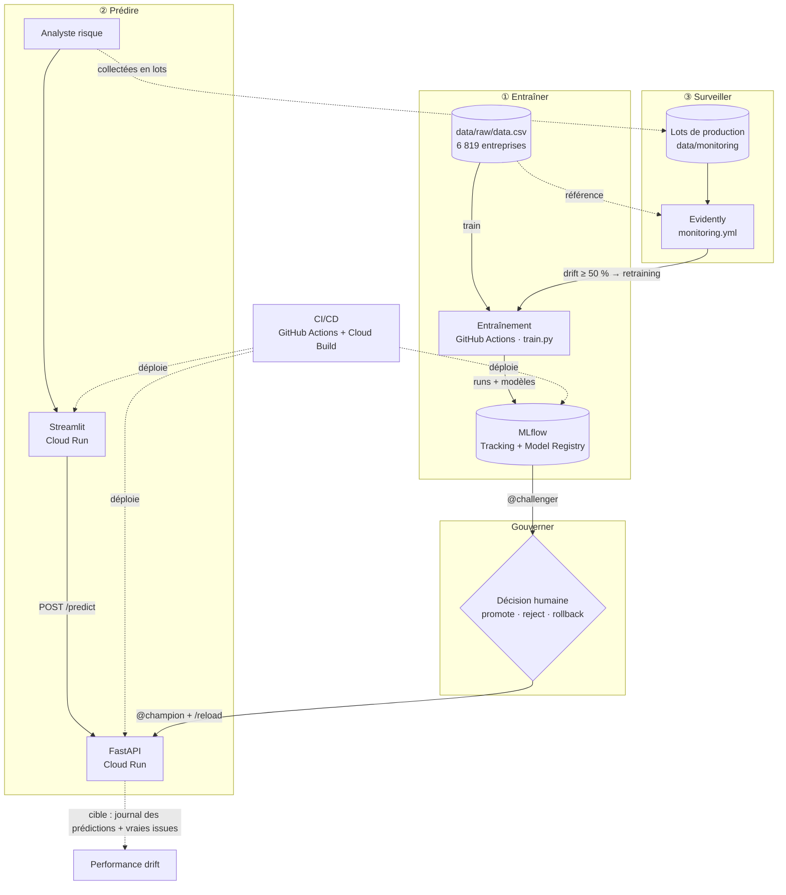

# Architecture

Ce document décrit les composants d'EnterpriseRisk AI, leurs échanges, l'infrastructure qui les héberge et les choix de conception. Pour l'exploitation au quotidien, voir le [runbook](runbook.md).

## 1. Vue d'ensemble : trois boucles

| Boucle | Question à laquelle elle répond | Composants |
|---|---|---|
| **Entraîner** | Quel est le meilleur modèle, et comment le prouver ? | données, `train.py`, MLflow |
| **Prédire** | Quel est le risque de cette entreprise, et quel modèle l'a calculé ? | Streamlit, FastAPI, alias `@champion` |
| **Surveiller** | Les données reçues ressemblent-elles encore à celles de l'entraînement ? | lots de production, Evidently, `monitoring.yml` |
| **Gouverner** | Ce nouveau modèle doit-il remplacer l'actuel ? | alias MLflow, décision humaine, `/reload` |

## 2. Composants

### 2.1 Préparation des données — `src/data/`

- `preprocess.py` : chargement du CSV, nettoyage des noms de colonnes (le CSV UCI contient des espaces en tête), contrôles de qualité, découpage stratifié 80/20 (`random_state=42`), transformations dans des `Pipeline` scikit-learn (`QuantileClipper`, `RobustScaler` pour les modèles linéaires).
- `select_features.py` : sélection des 5 variables (importance par permutation d'une Random Forest, en validation croisée, filtre de stabilité, décorrélation). Résultats dans `reports/`.
- `features.py` : liste de référence des 5 variables (`SELECTED_FEATURES`), utilisée par l'entraînement et le monitoring.

### 2.2 Entraînement — `src/training/`

- `models.py` : les 3 candidats et leurs grilles d'hyperparamètres (régression logistique, arbre de décision, XGBoost).
- `train.py` : pour chaque candidat, recherche d'hyperparamètres en validation croisée stratifiée à 5 plis, avec `refit` sur la PR-AUC ; enregistrement du run dans MLflow ; sélection du meilleur candidat ; évaluation unique sur le jeu de test ; pose de l'alias `MODEL_ALIAS` (`challenger` par défaut).
- Exécution : workflow `retraining.yml`, sur un runner GitHub.

### 2.3 MLflow — `services/mlflow/`

- Serveur MLflow 3.16 conteneurisé, déployé sur Cloud Run.
- **Backend store** (`BACKEND_STORE_URI`) : base Postgres contenant les métadonnées (runs, paramètres, métriques, versions, alias).
- **Artifact store** (`ARTIFACT_ROOT`) : bucket S3 `mlflow-artifact-enterpriseriskai` contenant les fichiers de modèles.
- Les clients (entraînement, API) écrivent et lisent **directement** dans S3 : ils ont besoin de leurs propres identifiants AWS.

### 2.4 API — `services/api/`

- FastAPI + Pydantic. Au démarrage, charge `models:/{MODEL_NAME}@{MODEL_ALIAS}` depuis MLflow et garde le modèle en mémoire.
- Routes `/health`, `/predict`, `/reload`, et documentation automatique sur `/docs`. Détails : [api.md](api.md).
- Si le modèle ne peut pas être chargé au démarrage, l'application s'arrête : Cloud Run ne bascule alors pas le trafic vers la nouvelle révision.

### 2.5 Interface — `services/app/`

- Streamlit : saisie des 5 ratios (deux exemples réels pré-remplis), appel de `/predict`, affichage du score, de la décision et de la réponse complète. Boutons « Vérifier /health » et « Recharger le modèle /reload ».

### 2.6 Monitoring — `src/monitoring/`

- `monitor.py` : génération des lots simulés, comparaison d'un lot à la référence d'entraînement (Evidently, test de Kolmogorov-Smirnov par variable), verdict, rapport HTML/JSON, transmission du résultat à GitHub Actions (`GITHUB_OUTPUT`).
- `evidently_ui.py` : envoi des rapports vers un espace Evidently (local par défaut, distant ou Cloud selon les variables d'environnement) et création du tableau de bord.
- Détails : [monitoring.md](monitoring.md).

## 3. Flux principaux

**Prédiction**
1. L'analyste saisit 5 ratios dans Streamlit.
2. Streamlit appelle `POST /predict`.
3. L'API renomme les champs vers les noms de colonnes d'entraînement, calcule le score avec le champion en mémoire, puis renvoie le score, la décision et l'identifiant du modèle.

**Surveillance et réentraînement**
1. `monitoring.yml` (planifié chaque jour, ou manuel) exécute `monitor.py` sur un lot de production.
2. Si au moins 50 % des variables dérivent, `drift_detected=true`, et le workflow appelle `retraining.yml` avec l'alias `challenger`.
3. Le nouveau modèle est enregistré en `@challenger` ; le champion continue de servir.
4. Un humain compare les deux modèles dans MLflow, déplace éventuellement l'alias `champion`, puis appelle `/reload`.

**Livraison du code**
1. Push sur une branche personnelle → `ci.yml` reconstruit l'image du service modifié.
2. Pull request relue → merge sur `main`.
3. Cloud Build reconstruit et redéploie le service sur Cloud Run.

## 4. Infrastructure

| Service Cloud Run | Image | Port | Configuration |
|---|---|---|---|
| `mlflow-erai` | `services/mlflow` | 8080 | `BACKEND_STORE_URI`, `ARTIFACT_ROOT`, identifiants AWS |
| `fastapi-erai` | `services/api` | 8000 | `MLFLOW_TRACKING_URI`, `MODEL_NAME`, `MODEL_ALIAS`, `THRESHOLD`, identifiants AWS |
| `streamliterai` | `services/app` | 8501 (ou `$PORT`) | `FASTAPI_URL` |

- Région : `europe-west1`.
- Secrets : **GCP Secret Manager**, injectés en variables d'environnement. Le compte de service Cloud Run doit avoir le rôle *Accesseur de secrets Secret Manager*.
- Workflows : secrets dans **GitHub Secrets** (`MLFLOW_TRACKING_URI`, `AWS_ACCESS_KEY_ID`, `AWS_SECRET_ACCESS_KEY`).
- AWS : l'utilisateur IAM utilisé dispose d'une politique limitée au bucket d'artefacts (`s3:ListBucket`, `s3:GetObject`, `s3:PutObject`, `s3:DeleteObject`).

## 5. Choix de conception

| Décision | Alternative écartée | Raison |
|---|---|---|
| PR-AUC comme métrique de sélection | Accuracy, ROC-AUC | Classe rare (3,2 %) : l'accuracy et la ROC-AUC sont flattées par les entreprises saines. La PR-AUC mesure la qualité du classement sur les faillites, ce qui correspond à l'usage (priorisation). |
| 5 variables | 95 variables | Contrat d'API simple, moins de variables à surveiller, modèle plus explicable ; forte redondance entre les ratios d'origine. |
| Alias MLflow (`@champion`) | Numéro de version dans la configuration de l'API | Promotion et rollback sans redéploiement : déplacer l'alias, puis `/reload`. |
| Promotion humaine | Promotion automatique après réentraînement | Un modèle réentraîné n'a encore rien prouvé. L'automatisation s'arrête là où commence le risque. |
| Test de Kolmogorov-Smirnov | Distance de Wasserstein (défaut d'Evidently) | Les valeurs extrêmes du dataset écrasent la distance de Wasserstein, qui ne détectait pas le choc simulé. K-S compare des rangs. |
| Alerte si ≥ 50 % des variables dérivent | Alerte dès une variable | Au seuil de 5 %, une variable sur vingt dérive par hasard ; le lot normal le montre (ROA(B)). |
| GitHub Actions pour entraîner et surveiller | Airflow, instance EC2 dédiée | Volume faible (quelques minutes d'entraînement), pas de nouvel outil à maintenir. En entreprise, un orchestrateur garantirait les horaires. |
| Cloud Build depuis le dépôt | Image poussée sur Docker Hub puis tirée | L'image est construite dans l'environnement d'exécution : un intermédiaire de moins. |
| Configuration par variables d'environnement | Valeurs dans le code | Portabilité entre environnements et fournisseurs ; aucun secret versionné. |

## 6. Évolutions prévues

- Quality gates automatiques avant promotion : Recall plancher, non-régression de la PR-AUC face au champion sur les mêmes données.
- Enregistrer uniquement le modèle retenu à chaque entraînement.
- Exécuter l'ensemble des tests dans `ci.yml`.
- Journaliser les prédictions, puis mesurer la performance réelle quand les issues sont connues (performance drift).
- Calibrer le score et fixer le seuil avec le métier.
